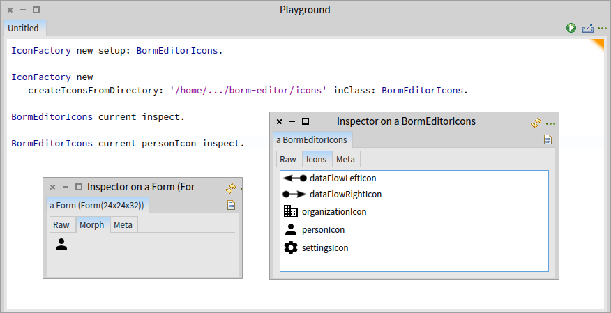

# IconFactory [](https://travis-ci.org/peteruhnak/IconFactory) [](https://coveralls.io/github/peteruhnak/IconFactory?branch=master)

IconFactory is a utility for importing PNG images from a directory into a class.

Each file will be compiled into the **class-side** of the target class as `<fileName>Icon` selector in base64 format. (Icon suffix will not be duplicated.).

This enables you to distribute the images directly with your source code.

Once imported, you can access the `Form` (Pharo's image representation) by sending the appropriate selector, e.g. `MyIcons myCoolIcon`.



Only PNG files are currently supported.

## Installation

Install `IconFactory` from **Catalog Browser**.

Or run the following script.

```smalltalk
Metacello new
    baseline: #IconFactory;
    repository: 'github://peteruhnak/IconFactory/repository';
    load
```

## Loading images into a class

If `MyIcons` class doesn't exist, it will be created in a category of the same name.

This method will install all images not present in #MyIcons and remove all selectors representing images that are not longer present in the directory.

```smalltalk
IconFactory
	syncDirectory: '/home/some/path/myIcons'
	intoClass: #MyIcons
```

You can use a bit of GUI too.

```smalltalk
d := UIManager default chooseDirectory.
IconFactory syncDirectory: d intoClass: #MyIcons
```

It effectively combines the following two options.

## Add only images

Add all images from the directory into the class.

```smalltalk
IconFactory
	loadDirectory: 'd:\some\path\myIcons'
	intoClass: #MyIcons
```

## Remove old selectors

Remove all selectors (images) from the class that are not present in the directory.

```smalltalk
IconFactory
	removeFromClass: #MyIcons
	notInDirectory: 'd:\some\path\myIcons'
```

## Creating icon for a single file

There are private methods that you can use at your own risk. Adding manually images one by one suggests a flaw in a workflow (that was the case for me anyway); but feel free to open a issue with your use case.

## Performance note

The data is stored as base64 in one `<name>IconContents` method and is converted to `Form` in `<name>Icon`. Because the conversion is slow, it is automatically cached by a Dictionary.

Depending on the size of the image (tested on 24x24) it can easily be 1000x times faster.

```smalltalk
"Without dictionary"
[ BormEditorIcons personIcon ] bench. "'2,271 per second'"

"With dictionary"
[ BormEditorIcons personIcon ] bench. "'3,228,827 per second'"
```
