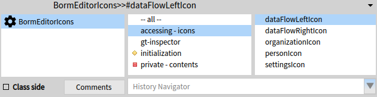

# IconFactory

**IconFactory is a utility for creating icons from files ala `ThemeIcons`.**




## 1. Installation

You can install it directly from **Catalog Browser**.

If you want to install it manually:

```st
Metacello new
	baseline: #IconFactory;
	repository: 'github://peteruhnak/IconFactory';
	load
```

## 2. Preparing an Icons Class
If you wish to have support for:

  - GTInspector support listing the icons
  - icon cache
  - singleton icon class

Then run (`MyIcons` class must already exist)

<pre><code>IconFactory new setup: MyIcons.
</code></pre>

**Note that this will create/override `initialize` method in `MyIcons`!**

## 3. Loading the Icons and Creating Selectors

To create the selectors you need to run

<pre><code>IconFactory new
	createIconsFromDirectory: '/my/directory/containing/png/icons'
	inClass: MyIcons.
</code></pre>

If you skipped the first step and do not want to use cache, use this instead

<pre><code>IconFactory new
	noCache;
	createIconsFromDirectory: '/my/directory/containing/png/icons'
	inClass: MyIcons.
</code></pre>

## 4. Using the icons

The name of the selector is based on the file name, so for file `/my/directory/logo.png`  you can use `MyIcons current logoIcon`.

(Or `MyIcons new logoIcon` if you don't use cache.)
